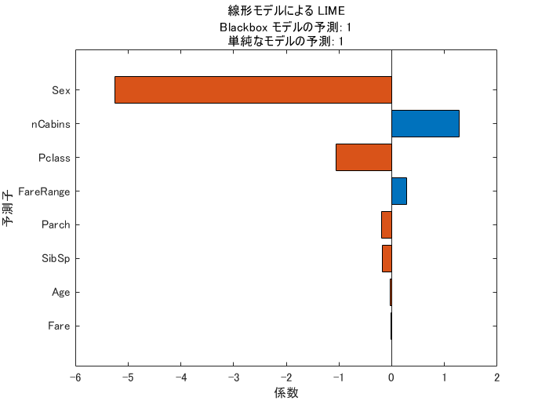
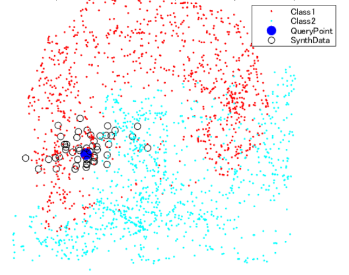
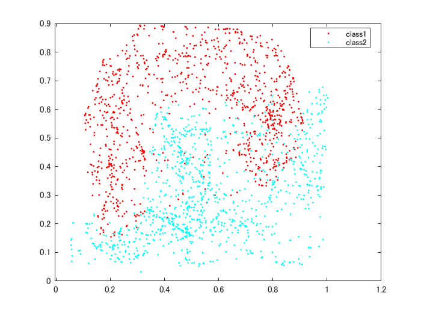
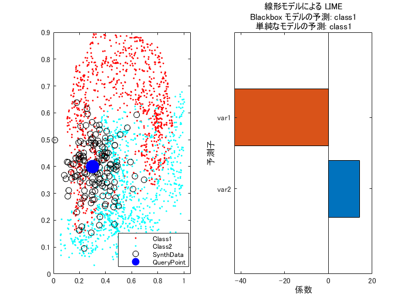
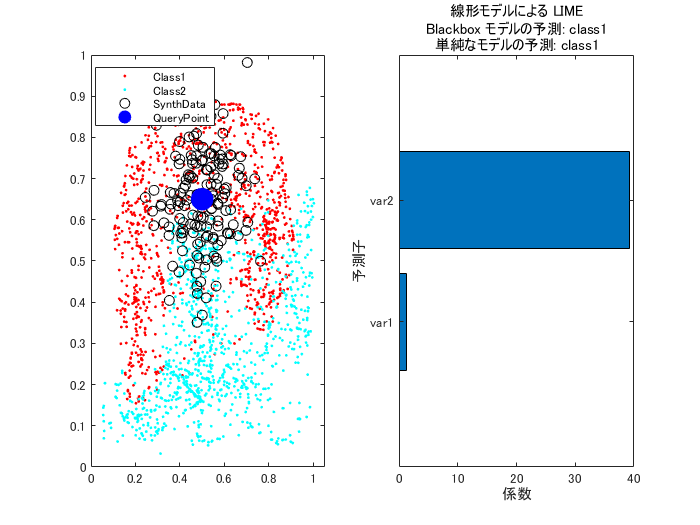
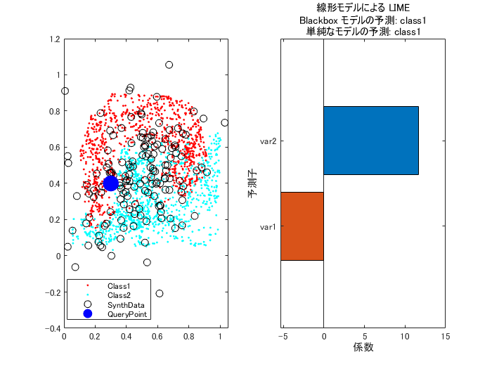
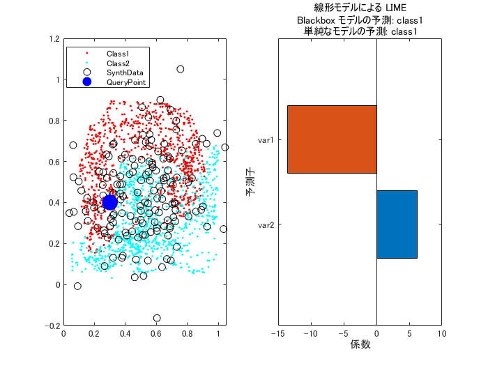

# 予測に重要な特徴量を見てみる：LIME (Local Interpretable Model-agnostic Explanations)
[](https://jp.mathworks.com/matlabcentral/fileexchange/84440-example-of-how-lime-works)

Copyright (c) 2020, The MathWorks, Inc.


# はじめに


機械学習のモデルの「説明性」としては大きく以下の２つをイメージしています。


   -  大域的説明性：モデル内の重要な説明変数を示す 
   -  局所的説明性：推論結果に強く影響した特徴量を示す 


この記事が注目するのは局所的説明性を与える手法としてちょっと前から気になっていた LIME。MATLAB R2020b で関数が提供されたので使ってみました。各種パラメータをきちんと調整しないと意味のない結果になる可能性があるなぁ、、というのを実感してみます。


  
## 利用環境

   -  MATLAB R2020b 
   -  Statistics and Machine Learning Toolbox 

  
# LIME: "Why Should I Trust You?": Explaining the Predictions of Any Classifier


KDD2016で採択されたこの論文（[https://arxiv.org/abs/1602.04938](https://arxiv.org/abs/1602.04938)）では、LIME 及び SP-LIMEという手法が提案されました。今回使ってみるのは前者 LIME。この例では実際に LIME を試してみて、どんな手法かざっくりイメージをもつことを意図していますので、厳密な定義については論文をあたってください。


  
## 何をするもの？


LIME は何らかの予測モデルが返す結果に対してどの変数がその予測結果に影響を与えたかについて”示唆”を与える手法です。Model-agnostic と名前に入っている通り、使用するモデルに依存しない手法で基本的にどんなモデルであっても使える概念という点がポイントかと。


よく使われる Titanic データを例にすると（参考：[Getting Started with Kaggle Data Science Competitions](https://blogs.mathworks.com/loren/2015/06/18/getting-started-with-kaggle-data-science-competitions/)）ある女性（38歳）が生存できたと予測された際に重要とされた変数は”性別（Sex）”だった、などと分かります。





## 参考資料

   -  [Interpretable Machine Learning, 5.7 Local Surrogate (LIME)](https://christophm.github.io/interpretable-ml-book/lime.html) 
   -  [“Why Should I Trust You?” Explaining the Predictions of Any Classifier](https://arxiv.org/abs/1602.04938) 


Statistics and Machine Learning Toolbox で提供している LIME においては、使える予測モデルとして回帰・分類ともに対応（[詳細リスト](https://jp.mathworks.com/help/stats/lime.html#mw_7fc9e00f-c752-47c0-b3bf-ffdb43f0e84f)）していますが、説明変数はテーブル型のみと考えてください。画像入力の分類モデル（例：CNN）に LIME を適用する場合には Deep Learning Toolbox で同じく R2020b で導入された [imageLIME](https://jp.mathworks.com/help/deeplearning/ref/imagelime.html) を使用します。


MATLAB サンプルコード：[Understand Network Predictions Using LIME](https://jp.mathworks.com/help/deeplearning/ug/understand-network-predictions-using-lime.html)（要：Deep Learning Toolbox）


imageLIME の内容については [Local Interpretable Model-Agnostic Explanations (LIME): An Introduction](https://www.oreilly.com/content/introduction-to-local-interpretable-model-agnostic-explanations-lime/) や File Exchange: [Explainable AI: interpreting the classification using LIME](https://jp.mathworks.com/matlabcentral/fileexchange/77828-explainable-ai-interpreting-the-classification-using-lime) もお勧めです。


  
# LIME のイメージ
  





青〇マークが予測対象の説明変数（QueryPoint）だとすると、この QueryPoint の予測における（局所的な）各特徴量の重要度を測ります。


手順は


   1.  QueryPoint の"近辺"に学習データの分布を参考に人工データを作成（中空〇） 
   1.  もとのモデルで作成データのラベルを予測 
   1.  作成したデータと上の予測結果をもとに解釈可能なモデル（線形モデル or 決定木）を学習し変数の影響力を評価 


線形モデルの場合はモデルの係数、決定木の場合は "分割による *"リスク"* 変動" をもとに算出します（[参考](https://jp.mathworks.com/help/stats/compactclassificationtree.predictorimportance.html)）。その際の人工データは 青〇 からの距離で重み付けされて計算されます。すでにいろんなパラメータが出てきましたね。


  
## まず近辺のデータとは？


`'queryPoint'` 近辺のデータはどう算出するのか？


作成されるデータ点数は `'NumSyntheticData'` （デフォルト値 5000）ですが、そのデータ分布は以下の 2 通りあります。


   -  `'DataLocality'` が `'global'` の場合：説明したい分類器  に使用したデータ全体の分布をもとに近辺のデータを作成します。 
   -  `'DataLocality'` が `'local'` の場合：`'queryPoint'` の近傍点の分布をもとにデータを作成します。そのデータ数は `'NumNeighbors'`（デフォルト値 1500）で指定します。 


近傍のデータを明示的に指定することもできます（`'customSyntheticData'` オプション）がこれを使うケースは稀かと思います。


  
## 重みづけ？


'queryPoint' の近くにある人工データを重視するよう重みが付けられますが、その程度を左右するのが `'KernelWidth' `(デフォルト値 0.75) この辺をどういじるかによって”説明”が異なります。


  
## さらに、重要な変数の数


解釈可能なモデルは元のモデルに使用したすべての説明変数を使用するわけではなく、`'numImportantPredictors'` 個の"重要"な変数の数をユーザーが指定する必要があります。


  
# ちょっとだけ細かい話


局所近似する分類器を求める目的関数は


   -   : 解釈可能なモデルの集合 
   -   :  のうちの一つのモデル 
   -   : 説明したい分類器 
   -   : データ  との距離 
   -   : データ  の周辺で  と  の結果がどれだけ違っているかの関数（下記） 
   -   : 説明用分類器  の複雑さ 


MATLAB だと  は以下の2つを `'SimpleModelType'` オプションで指定します。デフォルトは `'linear'`。


   -  `'linear'` — The software fits a linear model by using [`fitrlinear`](https://www.mathworks.com/help/releases/R2020b/stats/fitrlinear.html) for regression or [`fitclinear`](https://www.mathworks.com/help/releases/R2020b/stats/fitclinear.html) for classification. 
   -  `'tree'` — The software fits a decision tree model by using [`fitrtree`](https://www.mathworks.com/help/releases/R2020b/stats/fitrtree.html) for regression or [`fitctree`](https://www.mathworks.com/help/releases/R2020b/stats/fitctree.html) for classification. 


 については `'Distance'` オプションで設定しますが、選択によってより細かい設定項目があります。デフォルトは説明変数が連続値のみであれば `'euclidean'` そうでない場合（カテゴリカル変数を持つ場合）は `'goodall3'` です。


 の定義はこちら。


  
# 原著論文と違う点


上でも触れましたが、`'numImportantPredictors'` 個の"重要"な変数の数は指定する必要があります。個数さえ決定すれば重要な変数は選んでくれますが、その選択手法が異なります。


原著論文の場合は k-Lasso を使用するとの記載がありますが。MATLAB の場合は Group orthogonal matching pursuit (OMP) algorithm を使用します。両者の違いは以下の通りですが、主に処理速度が Group OMP の方が速いからというのが選択の理由とみられます。


   -  Lasso minimizes loss with L1 penalty on the linear coefficients. To get K nonzero coefficients, k-lasso needs to find the optimal lambda (the factor multiplying the L1 penalty) by experimentation. That is, k-lasso tries various values of lambda until it finds a value that gives exactly K nonzero coefficients. 
   -  OMP minimizes loss subject to the constraint on the number of nonzero coefficients. In other words, OMP solves the problem directly, without needing to use L1 penalty and find lambda by experimentation.  

  
# ダミーデータで雰囲気をつかもう


適当に作ったデータを使います。元モデルは kNN を使用します（なんでもよい）


```matlab:Code
rng(0)
load('dataSmote.mat')
model = fitcknn(newdata,'label');
```


こんなデータです


```matlab:Code
gscatter(newdata.var1,newdata.var2,newdata.label); % 元データ
```




## まず適当な1点目


まずは近傍データを作成する設定から。


`numNeighbors` 個の近傍データの分布をもとに、`numSyntheticData` 個の人工データを生成させることにします。


```matlab:Code
dataLocality = 'local';
numNeighbors = 381;
numSyntheticData = 153;
```


ここから `queryPoint` の予測における、変数の重要性を見てみます。


```matlab:Code
queryPoint = [0.3,0.4];
numImportantPredictors = 2; % 重要な変数の数を指定
```


LIME オブジェクト作成（単純なモデルは線形モデルとします。）


```matlab:Code
results = lime(model,'QueryPoint', queryPoint, ...
    'NumImportantPredictors', numImportantPredictors, ...
    'DataLocality', dataLocality,...
    'NumSyntheticData', numSyntheticData, ...
    'NumNeighbors', numNeighbors, ...
    'SimpleModelType',"linear");
```


結果を見てみます。


```matlab:Code
SynthData = results.SyntheticData; % 作成された人工データ

figure(1)
subplot(1,2,1)
gscatter(newdata.var1,newdata.var2,newdata.label); % 元データ
hold on
plot(SynthData.var1, SynthData.var2, 'ok');
plot(queryPoint(:,1),queryPoint(:,2),'ob','MarkerSize',13,'MarkerFaceColor',"blue");
legend(["Class1","Class2","SynthData","QueryPoint"])
hold off
subplot(1,2,2)
plot(results);
```





確かに青の QueryPoint の予測結果を決めるにあたって、変数 var1 (横軸) が重要そうな納得感はあります。


## 場所を移してもう１点


別の `queryPoint` の予測における、変数の重要性を見てみます。


```matlab:Code
queryPoint = [0.5,0.65];
```


LIME オブジェクト作成（単純なモデルは線形モデルとします。）


```matlab:Code
results = lime(model,'QueryPoint', queryPoint, ...
    'NumImportantPredictors', numImportantPredictors, ...
    'DataLocality', dataLocality,...
    'NumSyntheticData', numSyntheticData, ...
    'NumNeighbors', numNeighbors, ...
    'SimpleModelType',"linear");
```


結果を見てみます。


```matlab:Code
SynthData = results.SyntheticData; % 作成された人工データ

figure(1)
subplot(1,2,1)
gscatter(newdata.var1,newdata.var2,newdata.label); % 元データ
hold on
plot(SynthData.var1, SynthData.var2, 'ok');
plot(queryPoint(:,1),queryPoint(:,2),'ob','MarkerSize',13,'MarkerFaceColor',"blue");
legend(["Class1","Class2","SynthData","QueryPoint"])
hold off
subplot(1,2,2)
plot(results);
```





queryPoint の上下でラベルが変わるので、変数 var2 (縦軸) が重要と・・納得感はあります。


## 近傍データの作り方を変えてみる


データ分布の参考にする近傍データの数を増やしてみます。


```matlab:Code
numNeighbors = 1839;
queryPoint = [0.3,0.4];
```


LIME オブジェクト作成（単純なモデルは線形モデルとします。）


```matlab:Code
results = lime(model,'QueryPoint', queryPoint, ...
    'NumImportantPredictors', numImportantPredictors, ...
    'DataLocality', dataLocality,...
    'NumSyntheticData', numSyntheticData, ...
    'NumNeighbors', numNeighbors, ...
    'SimpleModelType',"linear");
```


結果を見てみます。


```matlab:Code
SynthData = results.SyntheticData; % 作成された人工データ

figure(1)
subplot(1,2,1)
gscatter(newdata.var1,newdata.var2,newdata.label); % 元データ
hold on
plot(SynthData.var1, SynthData.var2, 'ok');
plot(queryPoint(:,1),queryPoint(:,2),'ob','MarkerSize',13,'MarkerFaceColor',"blue");
legend(["Class1","Class2","SynthData","QueryPoint"])
hold off
subplot(1,2,2)
plot(results);
```





作成される人工データも大きく分布し、QueryPoint の局所性がボヤっとしてきました。先程は変数 var1（横軸）が重要そうでしたが、今度は var2（縦軸）が相対的に大きな重要度を持っています。


カーネルサイズ `'KernelWidth'` をいじって近傍のデータに重みを付けると元の結果に近くなるかもしれない。


LIME オブジェクト作成（単純なモデルは線形モデルとします。）


```matlab:Code
results = lime(model,'QueryPoint', queryPoint, ...
    'NumImportantPredictors', numImportantPredictors, ...
    'DataLocality', dataLocality,...
    'NumSyntheticData', numSyntheticData, ...
    'NumNeighbors', numNeighbors, ...
    'SimpleModelType',"linear",...
    "KernelWidth",0.1);
```


結果を見てみます。


```matlab:Code
SynthData = results.SyntheticData; % 作成された人工データ

figure(1)
subplot(1,2,1)
gscatter(newdata.var1,newdata.var2,newdata.label); % 元データ
hold on
plot(SynthData.var1, SynthData.var2, 'ok');
plot(queryPoint(:,1),queryPoint(:,2),'ob','MarkerSize',13,'MarkerFaceColor',"blue");
legend(["Class1","Class2","SynthData","QueryPoint"])
hold off
subplot(1,2,2)
plot(results);
```





変数 var1 (横軸) が重要そうとの結果に戻ってきました。。


  
# まとめ


[Interpretable Machine Learning, 5.7 Local Surrogate (LIME)](https://christophm.github.io/interpretable-ml-book/lime.html) でも以下のように触れている通り、”近傍”を決める設定を変えるだけでも結果は大きく異なる。”説明性”が担保させるにはどのパラメータを使うべきなのか、そもそも存在するのか、あるならきちんと調整しないと意味のない結果になる可能性は大きいように感じます。


> "As always, the devil is in the detail. Defining a meaningful neighborhood around a point is difficult. LIME currently uses an exponential smoothing kernel to define the neighborhood. A smoothing kernel is a function that takes two data instances and returns a proximity measure. The kernel width determines how large the neighborhood is: A small kernel width means that an instance must be very close to influence the local model, a larger kernel width means that instances that are farther away also influence the model (中略) The big problem is that we do not have a good way to find the best kernel or width."


